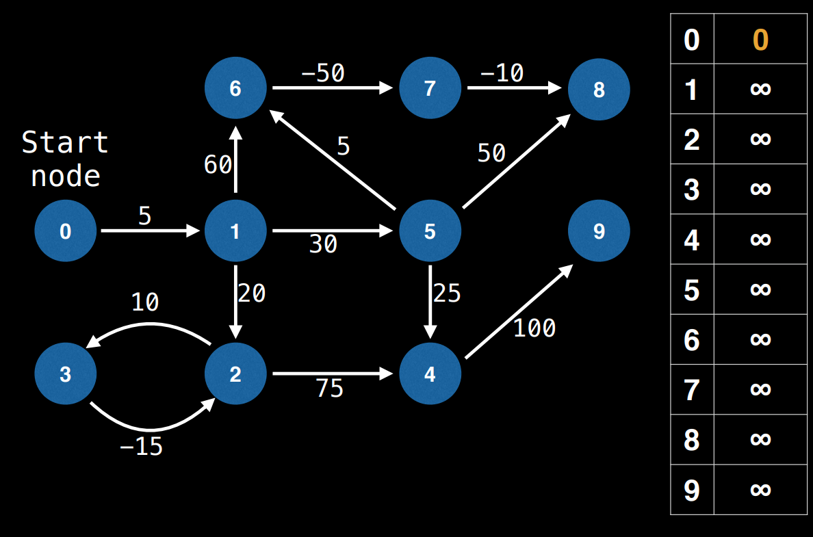
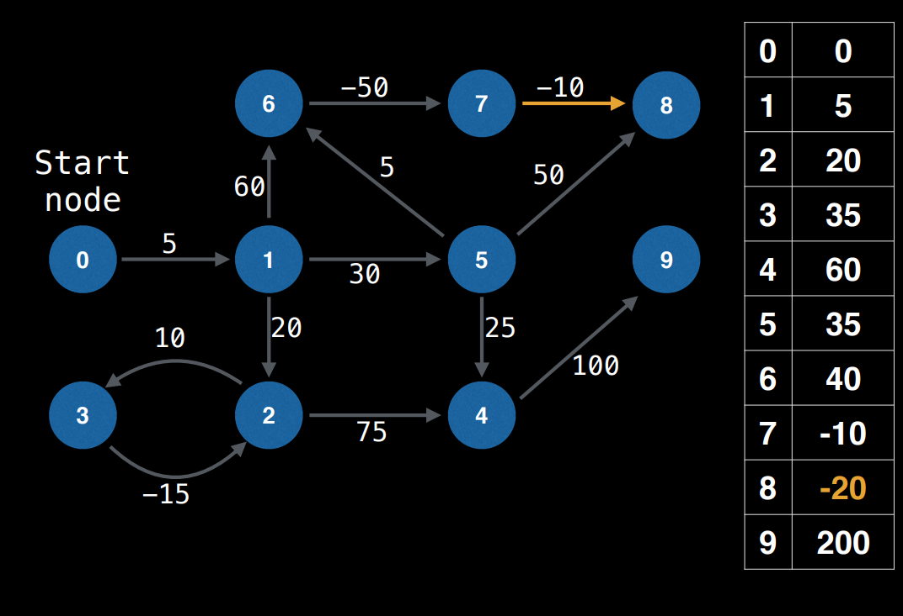
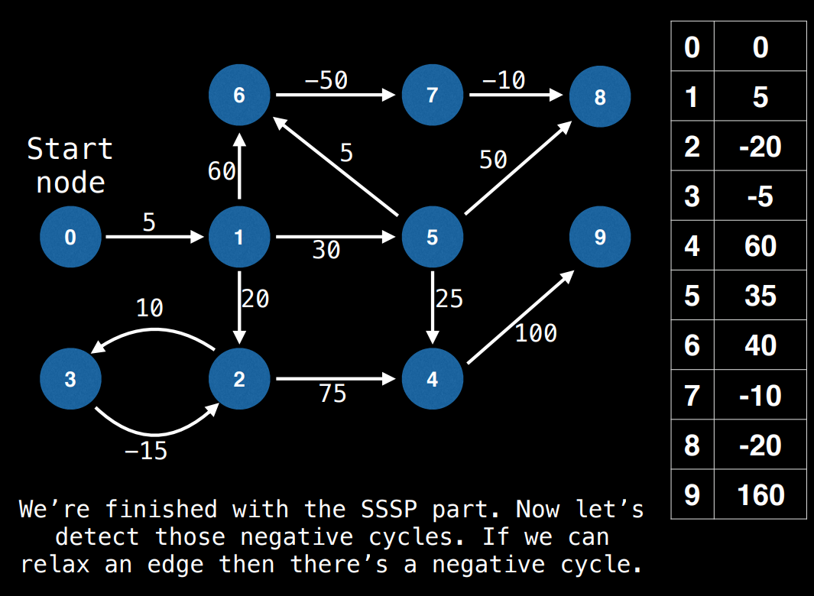

# Bellman-Ford Algorithm

In graph theory, the Bellman-Ford (BF) algorithm is a Single Source Shortest Path (SSSP) algorithm. This means it can find the shortest path from one node to any other node.

However, BF is not ideal for most SSSP problems because it has a time complexity of O(EV). It is better to use Djikstra's algorithm which is much faster. It is on the order of O((E+V)logV) when using a binary heap priority queue.

However, Djikstra's algorithm can fail when the graph has negative edge weights. This is when BF is really handy because it can be used to **detect negative cycles** and **determine where they occur**.

Finding negative cycles can be useful in many types of applications. One particularly neat application arises in finance when performing an **arbitrage** between two or more markets.


The yellow nodes are the nodes reachable by 1 i.e can be reached by a negative cycle.

## BF Algorithm Steps

Let's define a few variables

Let **E** be the number of edges
Let **V** be the number of vertices
Let **S** be the id of the starting node
Let **D** be an array of size **V** that tracks the best distance from **S** to each node.

1. Set ever entry in D to Infinity
2. Set `D[S] = 0`
3. Relax each edge V-1 times: Relaxing an edge simply means taking an edge and trying to update the value from where the edge starts to where it ends.

```code
for(i = 0; i < V-1; i = i + 1):
    for edge in graph.edges:
        // relax edge (update D with shorter path)
        if(D[edge.from] + edge.cost < D[edge.to]):
            D[edge.to] = D[edge.from] + edge.cost

// Repeat to find nodes caught in a negative cycle
for(i = 0; i < V-1; i = i + 1):
    for edge in graph.edges:
        // relax edge (update D with shorter path)
        if(D[edge.from] + edge.cost < D[edge.to]):
            D[edge.to] = -Infinty
```



After the first iteration, this is what it looks like:



At the end of all iterations:



We run the algorithm again to detect negative cycles:


## Code

[Bellman Ford With Edge List](../Bellman-Ford\bellmanFord.js)
