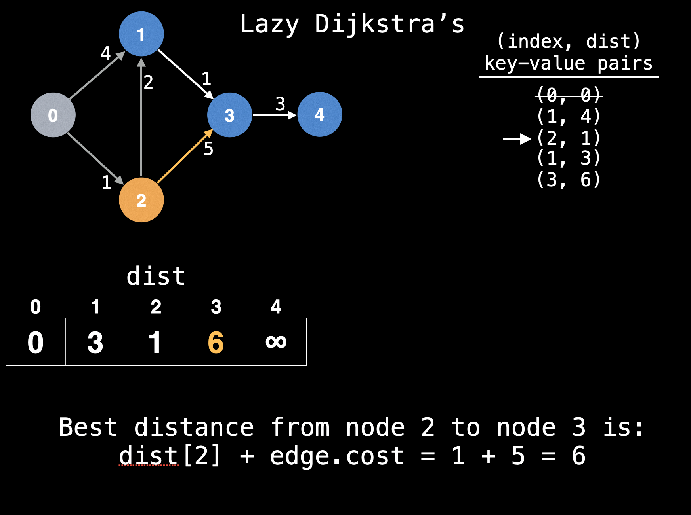

# Dijkstra's Shortest Path Algorithm

## What is Dijkstra's algorithm?

It's a Single Source Shortest Path (SSSP) algorithm for graphs with **non-negative weights**. Depending on how the algorithm is implemented and what data structures are used the time complexity is typically O(E\*log(V)).

## Algorithm Prerequisites

One constraint - non negative weights. This is to ensure that once a node is visited its optimal distance cannot be improved.
This property is essential as it enables Dijkstra's algorithm to act in a greedy manner by always selecting the next most promising node.

## Quick Algorithm Overview

Maintain a 'dist' array where the distance to every node is positive infinity. Mark the distance to start node 's' as 0.

Maintain a PQ of key-value pairs of (nodeIndex, distance) pairs which tell you which node to visit next based on sorted min value.

Insert (s, 0) into the PQ and loop while PQ is not empty pulling out the next most promising (nodeIndex, distance) pair.

Iterate over all edges outwards from the current node and relax each edge appending a new (nodeIndex, distance) key-value pair to the PQ for every relaxation.





**Pseudocode:**

```code
// Run Dijkstra's algorithm and returns an array that contains the shortest distance to every node from start node s
// g - adj list of weighted graph
// n - number of nodes in the graph
// s - the index of the starting node (0 <= s < n)

function dikjstra(g, n, s):
    vis = [false, false, ... , false] // size n
    dist = [inf, inf, ... , inf] // size n
    dist[s] = 0
    pq = empty priority queue
    pq.insert((s,0))
    while pq.size() !== 0:
        index, minValue = pq.poll()
        vis[index] = true

        for(edge: g[index])
            if(vis[edge.to]): continue
            newDist = dist[index] + edge.cost
            if(newDist < dist[edge.to]):
                dist[edge.to] = newDist
                pq.insert((edge.to, newDist))

    return dist
```

**Optimzation to ignore stale nodes:**

A neat optimization we can do which ignores stale (index, dist) pairs in our PQ is to skip nodes where we already found a better path routing through others nodes before we get to processing this node.

```code
// Run Dijkstra's algorithm and returns an array that contains the shortest distance to every node from start node s
// g - adj list of weighted graph
// n - number of nodes in the graph
// s - the index of the starting node (0 <= s < n)

function dikjstra(g, n, s):
    vis = [false, false, ... , false] // size n
    dist = [inf, inf, ... , inf] // size n
    dist[s] = 0
    pq = empty priority queue
    pq.insert((s,0))
    while pq.size() !== 0:
        index, minValue = pq.poll()
        vis[index] = true

        if(dist[index] < minValue): continue // <-------------- NEW LINE

        for(edge: g[index])
            if(vis[edge.to]): continue
            newDist = dist[index] + edge.cost
            if(newDist < dist[edge.to]):
                dist[edge.to] = newDist
                pq.insert((edge.to, newDist))

    return dist
```

## Finding the optimal path

If you wish to not only find the optimal distance to a particular node but also **what sequence of nodes were taken** to get there you need to track some additional information.
In particular, we'll want to keep track of the index of the previous node we took to get to the current node.

```code
// Run Dijkstra's algorithm and returns an array that contains the shortest distance to every node from start node s
// g - adj list of weighted graph
// n - number of nodes in the graph
// s - the index of the starting node (0 <= s < n)

function dikjstra(g, n, s):
    vis = [false, false, ... , false] // size n
    prev = [null, null, .... , null] // size n <------------------- NEW LINE
    dist = [inf, inf, ... , inf] // size n
    dist[s] = 0
    pq = empty priority queue
    pq.insert((s,0))
    while pq.size() !== 0:
        index, minValue = pq.poll()
        vis[index] = true

        if(dist[index] < minValue): continue // <-------------- NEW LINE

        for(edge: g[index])
            if(vis[edge.to]): continue
            newDist = dist[index] + edge.cost
            if(newDist < dist[edge.to]):
                prev[edge.to] = index // <---------------- NEW LINE
                dist[edge.to] = newDist
                pq.insert((edge.to, newDist))

    return (dist, prev)

// Finds the shortest path between two nodes
// g - adj list of weighted graph
// n - number of nodes in the graph
// s - the index of the starting node
// e - the index of the end node
find shortestPath(g, n, s, e):
    dist, prev = dijkstra(g, n, s)
    path = []
    if(dist[e] == Inf) return path

    for(at = e; at !== null; at = prev[at]):
        path.add(at)
    path.reverse()
    return path
```

## Stopping Early

Q: Suppose you know the destination node you're trying to reach is 'e' and you start at node 's', do you still have to visit every node in the graph?
A: Yes, in the worst case. However, it is possible to stop early once you have finished visiting the destination node.

The main idea for stopping early is that Dijkstra's algorithm processes each next most promising node in order. So if the destination node has been visited, its shortest distance will not change as more future nodes are visited.

In terms of code, we can do this with a simple addition:

```code
// Run Dijkstra's algorithm and returns an array that contains the shortest distance to every node from start node s
// g - adj list of weighted graph
// n - number of nodes in the graph
// s - the index of the starting node (0 <= s < n)
// e - the index of the ending node (0 <= e < n) <------- NEW ARGUMENT
function dikjstra(g, n, s, e):
    vis = [false, false, ... , false] // size n
    prev = [null, null, .... , null] // size n
    dist = [inf, inf, ... , inf] // size n
    dist[s] = 0
    pq = empty priority queue
    pq.insert((s,0))
    while pq.size() !== 0:
        index, minValue = pq.poll()
        vis[index] = true

        if(dist[index] < minValue): continue

        for(edge: g[index])
            if(vis[edge.to]): continue
            newDist = dist[index] + edge.cost
            if(newDist < dist[edge.to]):
                prev[edge.to] = index
                dist[edge.to] = newDist
                pq.insert((edge.to, newDist))
        if(inedx === e): // <----------------------- NEW LINE
            return dist[e] // <----------------------- NEW LINE

    return Inf // <----------------------- NEW LINE
```

## Indexed Priority Queue

Our current lazy implementation inserts duplicate key value pairs in our PQ because it's more efficient to insert a new key-value pair in O(logn) than it is to update an existing key's value in O(n).

This approach is inefficient for dense graphs because we end up with several stale outdated key value pairs in our PQ. The eager version of Dijkstra's avoids duplicate key value pairs and supports efficient value updates in O(logn) by using an Indexed Priority Queue.

## D-ary Heap Optimization

When executing Dijkstras algorithm on dense graphs, there are a lot more updates (decreaseKey operations) to key-value pairs than there are dequeue operations.

A D-ary heap is a heap variant in which each node has D children. This speeds up the decreaseKey operation at the expense of more costly removals.

Q; What is the optimal D-ary heap degree to maximize performance of Dijkstras algorithm?

In general **D = E/V** is the best degree to use to balance removals against decreaseKey operations improving Dijkstra's time complexity to O(E\*log(V)) where the log is of base E/V which is much better especially for dense graphs which has lots of decreaseKey operations.
