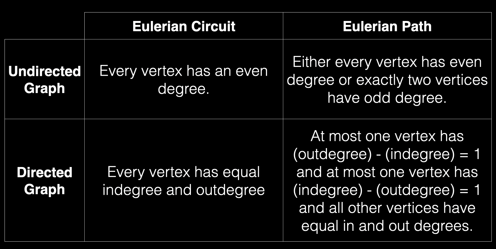
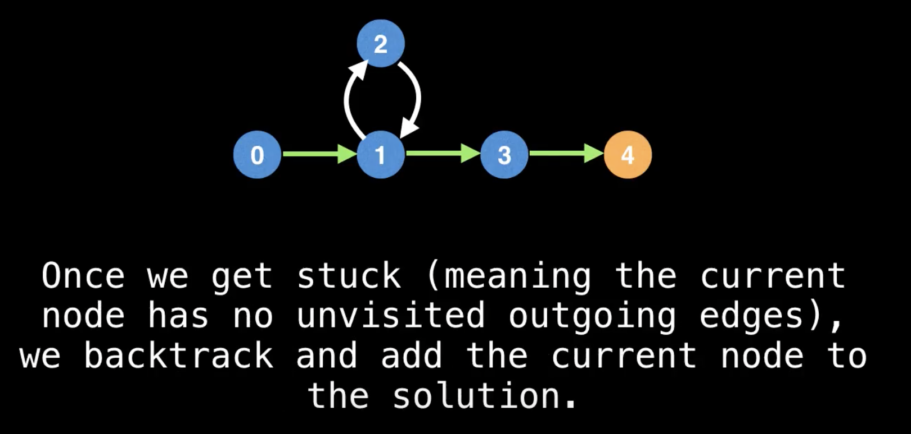
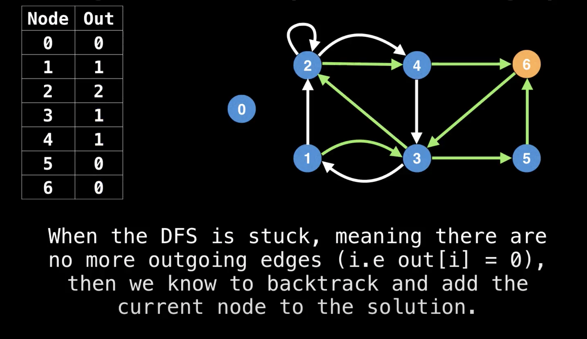

# Eulerian Paths and Circuits

## What is an Eulerian Path?

An **Eulerian Path** (or Eulerian Trail) is a path of edges that visits all the edges in a graph exactly once.

## What is an Eulerian Circuit?

Similarly, an **Eulerian Circuit** (or Eulerian cycle) is an Eulerian path which starts and ends on the same vertex.

## What conditions are required for a valid Eulerian path/circuit?

That depends on what kind of graph you’re dealing with. Altogether there are four flavors of the Euler path/circuit problem we care about:



### Finding an Eulerian Path

Step 1: to finding an Eulerian path is determining if there even exists an Eulerian path.
Recall that for an Eulerian path to exist at most one vertex has (outdegree) - (indegree) = 1 and at most one vertex has (indegree) - (outdegree) = 1 and all other vertices have equal in and out degrees.

Count the in/out degrees of each node by looping through all edges.

Once we have verified that no node has too many outgoing edges (out[i] - in[i] > 1) or incoming edges (in[i] - out[i] > 1) and there are just the right amount amount of start/end nodes we can be certain that an Eulerian path exists. The next step is to find a valid starting node.

If there's a node with an extra outgoing edge, that is a valid start node. Similarly, the node with an extra incoming edge is the only valid ending node. If all in and out degrees of all nodes were equal, any node with a non-zero degree can serve as a suitable starting node.

Let's see what happens if we do a naive DFS, trying to traverse as many edges as possible till we get stuck.
In a DFS, by randomly sleecting edges you will notice that while you do get from the start node to the end node, we do not find an Eulerian path as you do not traverse all the edges in the graph.

The good news is that we can modify our DFS to handle forcing the traversal of all edges.

Consider this graph, where we start a DFS at node 0 and reach node 4.



When backtrcking, if the current node has any remaining unvisited edges, we follow them calling DFS recursively to extend the Eulerian path.

Since we have already calculated the outdegree of all nodes to determine if it was an Eulerian path, we can reuse that to determine if a node has more edges remaining.
Once we start the DFS, we can start decrementing the out degree array.



The time complexity to find an Eulerian path with this algorithm is O(E). The two calculations we're doing: computing the in/out degrees + DFS are both linear in the number of edges.

### Pseudocode

```code
# Global or class scope variables

n = number of vertices in the graph
m = number of edges in the graph
g = adjacency list representing directed graph

in = [0, 0, ..., 0] # Length n
out = [0, 0, ..., 0] # Length n

path = empty integer linked list or array data structure

function findEulerianPath():
    countInOutDegrees()
    if not graphHasEulerianPath(): return null

    dfs(findStartNode())

    # Return the Eulerian path if we traversed all the edges. The graph might be disconnected
    # in which case it's impossible to have an eulerian path
    if path.length == m + 1 return path
    return null

function countInOutDegrees():
    for edges in g:
        for edge in edges:
            out[edge.from]++
            in[edge.to]++

function graphHasEulerianPath():
    start_nodes, end_nodes = 0, 0
    for(i = 0; i < n; i++):
        if(out[i] - in[i]) > 1 or (in[i] - out[i]) > 1:
            return false
        else if out[i] - in[i] === 1:
            start_nodes++
        else if in[i] - out[i] == 1:
            end_nodes++;

    return (end_nodes === 0 and start_nodes === 0) or (end_nodes === 1 and start_nodes === 1)

function findStartNode():
    start = 0;
    for(i = 0; i < n; i++):
        # unique starting node
        if out[i] - in[i] == 1: return i

        # start at any node with an outgoing edge
        # This check prevents us starting the DFS from a singleton
        if out[i] > 0: start = i
    return start

function dfs(at):
    # while the current node still has outgoing edges
    while(out[at] !== 0):

        # select the next unvisited outgoing edge
        # Explanation: g[at] gives us a list of edges. we get the last edge from the list
        # and then decremenet the out so next time we'll get the next edge from behind
        next_edge = g[at].get(--out[at])
        dfs(next_edge.to)

    # add current node to solution
    path.insertFirst(at)
```

## CODE

[Code](../EulerianPathsAndCircuits/eulerianpath.js)
