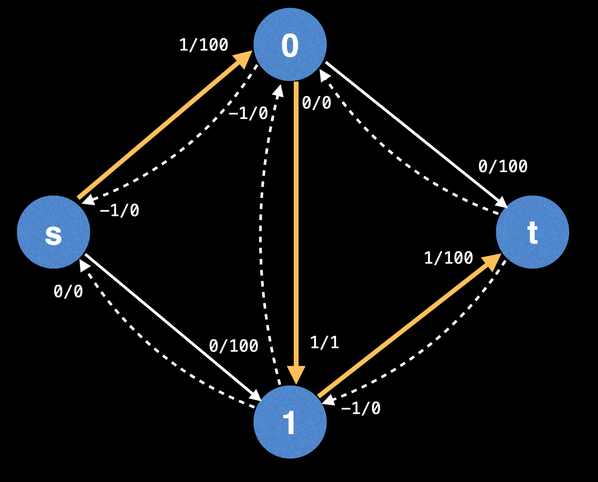

# Network Flow

## 1. Maximum Flow

Finding the maximum flow begins with having a "flow" graph. This is a graph where edges have a certain max capacity which cannot be exceeded. Edges also have a flow value which is how many units of flow are passing through that edge. Initially the flow is 0 for all edges until you run a max flow algorithm on it.

There are 2 special types of nodes in the flow graph - the source node and the sink node.

The max flow problem - With an infinite input source, how much "flow" can we push through the network given that each edge has a certain capacity.

Suppose the edges are roads with cars, pipes with water or wires with electric current. Flow represents the volume of water allowed to flow through the pipes, the number of cars the roads can sustain in traffic and net electric current. Effectively, it’s the “bottleneck” value for the amount of flow that can pass through the network from source to sink under all the constraints.

A flow graph (flow network) is a directed graph where each edge (also called an arc) has a certain capacity which can receive a
certain amount of flow. The flow running through an edge must be less than or equal to the capacity.

Each edge in the flow graph has a certain flow and capacity specified by the fraction adjacent to each edge. Initially, the flow through each edge is 0 and the capacity is a non negative value.

To find the maximum flow (and min-cut as a by product), the Ford-Fulkerson method repeatedly finds **augmenting paths** through the **residual graph** and **augments the flow** until no more augmenting paths can be found.

An **augmenting path** is a path of edges in the residual graph with unused capacity greater than zero from the source s to the sink t. The orange path highlighted is one of the possible augmenting paths. You'll know that you have achieved the max flow when you cannot find any more augmenting paths in a graph.

How do we find an augmenting path?
This is detail left unspecified by the Ford-Fulkerson method for flexibility. For now let's assume that we'll be using DFS.

In the augmenting path above, the bottleneck is the “smallest” edge on the path. We can use the bottleneck value to **augment the flow** along the path.

The smallest remaining capacity of any edge along the augmenting path is:
min(10-0, 15-0, 6-0, 25-0, 10-0) = min(10,15,6,25,10) = 6

**Augmenting the flow** means **updating** the flow values of the edges along the augmenting path.

Here you see that the graph has increase the flow of each edge along the augmenting path by 6 unites.

For forward edges, this means increasing the flow by the bottleneck value.

When augmenting the flow along the augmenting path, you also need to decrease the flow along each residual edge by the bottleneck value.

Residual edges exist to “undo” bad augmenting paths which do not lead to a maximum flow.

Effectively, we don't know which are the best or even correct augmenting paths to take so this mechanism enables us to freely take any augmenting path without having to worry about whether we will achieve the maximum flow because residual edges turn into valid edges you can take while finding an augmenting path.

You can think of every edge in the original graph as having a residual edge with a flow/capacity of 0/0 which is not usually shown.

The **residual graph** is the graph which also contains residual edges.

Q: Residual edges have a capacity of 0? Isn’t that forbidden? How does that work?

A. Think of the remaining capacity of an edge e (residual or not) as: e.capacity - e.flow, This ensures that the remaining capacity of an edge is always non-negative (even if the flow can be negative)

The Ford-Fulkerson method continues finding augmenting paths and augments the flow until no more augmenting paths from s -> t exist.

A key realization to make at this point is that the sum of the bottlenecks found in each augmenting path is equal to the max-flow!

No more augmenting paths can be found, so the algorithm terminates!

max flow = sum of all bottleneck values = 6 + 4 + 6 + 4 = 20

The time complexity of the Ford-Fulkerson method depends on the algorithm being used to find the augmenting paths, which is left unspecified.

Assuming the method of finding augmenting paths is by using a Depth First Search (DFS), the algorithm runs in O(fE), where f is the maximum flow and E is the number of edges.

Consider this graph:

The network flow is 200 using the outer edges. But Recall that a DFS traversal chooses edges in a random order, so it is possible to pick the middle edge every time when finding an augmenting path.

This results in flipping back and forth between the same two alternating paths for 200 iterations…

There are other much faster algorithms and heuristics to find the maximum flow:

**Edmonds-Karp:** Uses a BFS as a method of finding augmenting paths, O(E²V)

**Capacity scaling:** Adds a heuristic on top of Ford-Fulkerson to pick larger paths first, O(E²log(U)) (where U is the value of the largest edge capacity in the initial flow graph).

**Dinic’s algorithm:** Uses combination of BFS + DFS to find augmenting paths, O(V²E)

**Push Relabel:** Uses a concept of maintaining a "preflow" instead of finding augmenting paths to achieve a max-flow solution, O(V²E) or O(V²√E) variant.

NOTE: Be mindful that the time complexities for flow algorithms are very pessimistic. In practice, they tend to operate much faster, making it hard to compare the performance of flow algorithms solely based on complexity.
