# Prim's Minimum Spanning Tree

## What is a Minimum Spanning Tree?

Given an undirected graph with weighted edges, a **MST** is a subset of the edges in the graph which connects all vertices together (without creating any cycles) while minimizing the total edge cost.

This particular graph has a unique MST highlighted in green. However, it is common for a graph to have multiple valid MSTs of equal costs.

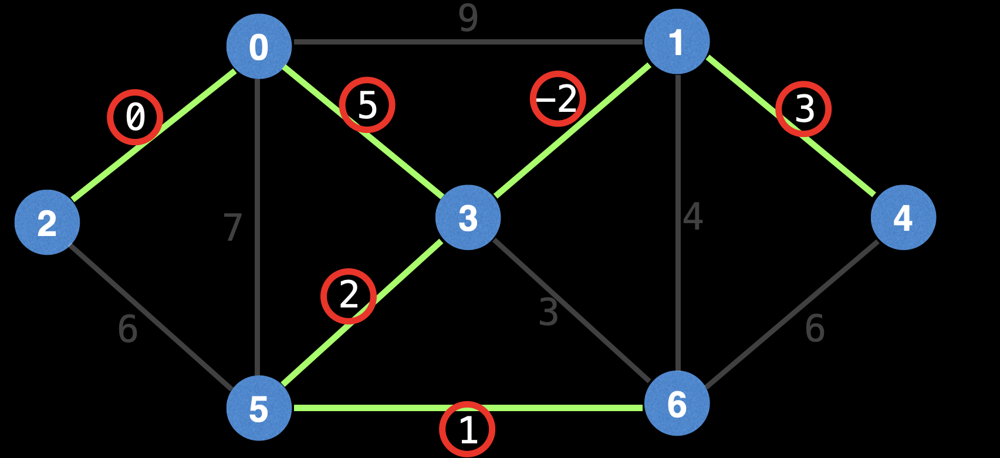

MST Cost: 0 + 5 + -2 + 2 + 1 + 3 = 9

## Prim's MST ALgorithm

Prim’s is a greedy MST algorithm that works well on dense graphs. On these graphs, Prim’s meets or improves on the time bounds of its popular rivals (Kruskal’s & Borůvka’s).

However, when it comes to finding the **minimum spanning forest** on a disconnected graph, Prim’s cannot do this as easily (the algorithm must be run on each connected component individually).

The lazy version of Prim’s has a runtime of `O(E*log(E))`, but the eager version (which we will also look at) has a better runtime of `O(E*log(V))`.

### Lazy Prim's MST Overview

Maintain a min Priority Queue (PQ) that sorts edges based on min edge cost. This will be used to determine the next node to visit and the edge used to get there.

Start the algorithm on any node s. Mark **s** as visited and iterate over all edges of s, adding them to a PQ.

While the PQ is not empty and a MST has not been formed, dequeue the next cheapest edge from the PQ. If the dequeued edge is outdated (meaning the node it points to has already been visited) then skip it and poll again. Otherwise, mark the current node as visited and add the selected edge to the MST.

Iterate over the new current node's edges and add all it's edges to the PQ. Do not add edges to the PQ which point to already visited nodes.

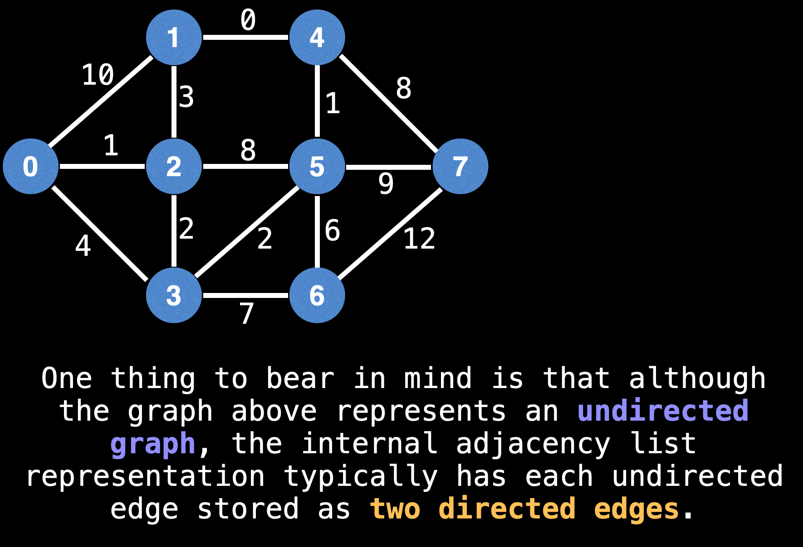
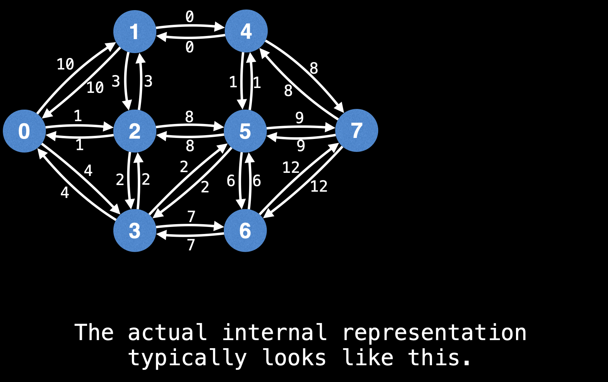

Let's start from node 0 and add all it's edges to the PQ.
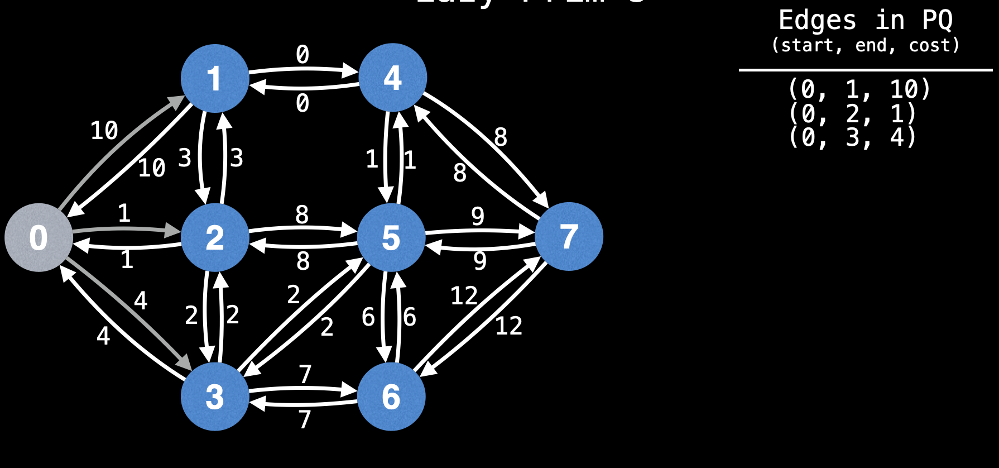

Pick the edge with the least weight from the PQ and continue
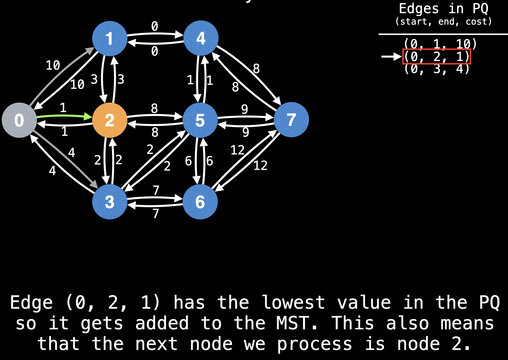
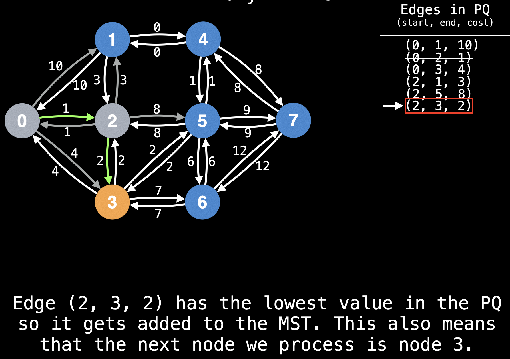
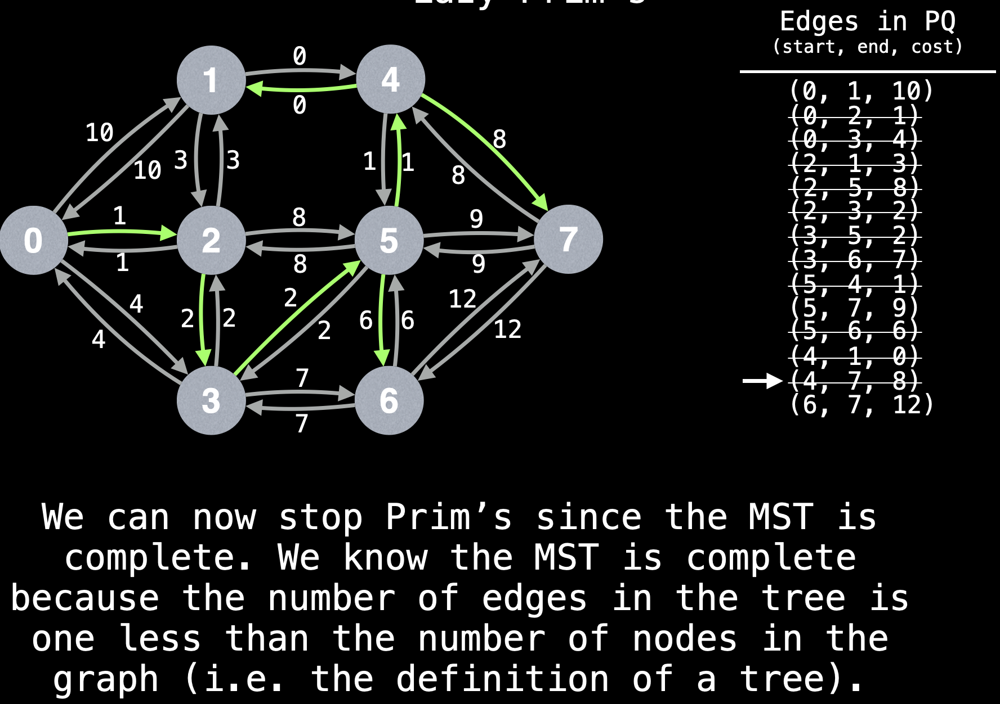

### Lazy Prim's Pseudocode

Let's define a few variables we will need

```code
n = … # Number of nodes in the graph.

pq = … # PQ data structure; stores edge objects consisting of
       # {start node, end node, edge cost} tuples. The PQ sorts
       # edges based on min edge cost.

g = … # Graph representing an adjacency list of weighted edges.
      # Each undirected edge is represented as two directed
      # edges in g. For especially dense graphs, prefer using
      # an adjacency matrix instead of an adjacency list to
      # improve performance.

visited = [false, …, false] # visited[i] tracks whether node i
                            # has been visited; size n


# s - the index of the starting node (0 ≤ s < n)
function lazyPrims(s = 0):
    m = n - 1 # number of edges in MST
    edgeCount, mstCost = 0, 0
    mstEdges = [null, …, null] # size m
    addEdges(s)

    while(!pq.isEmpty() and edgeCount !== m):
        edge = pq.dequeue()
        nodeIndex = edge.to

        if visited[nodeIndex]:
            continue

        mstEdges[edgeCount++] = edge
        mstCost += edge.cost

        addEdges(nodeIndex)

    if edgeCount !== m:
        return (null, null) # NO MST

    return (mstCost, mstEdges)

// Helper method to iterate over the edges of a node and add edges to the PQ:
function addEdges(nodeIndex):
    // mark the current node as visited
    visited[nodeIndex] = true;

    // Iterate over all edges going outwards from the current node.
    // add edges to the PQ which point to unvisited nodes
    edges = g[nodeIndex]
    for(edge: edges):
        if !visited[edge.to]:
            pq.enqueue(edge)
```

---

## Eager Prim's

The lazy operation of Prim's inserts upto E edges in the PQ. Therefore, each poll on the PQ is **O(logE)**.

Instead of blindly inserting edges into a PQ which could later become stale, the eager version of Prim's tracks (node, edge) key-value pairs that can easily be updated and polled to determine the next best edge to add to the MST.

**Key Realization:** for any MST with directed edges, each node is paired with exactly one of it's incoming edges (except the start node).
This can easily be seen on a directed MST where you can have multiple edges leaving a node, but at most one entering a node.

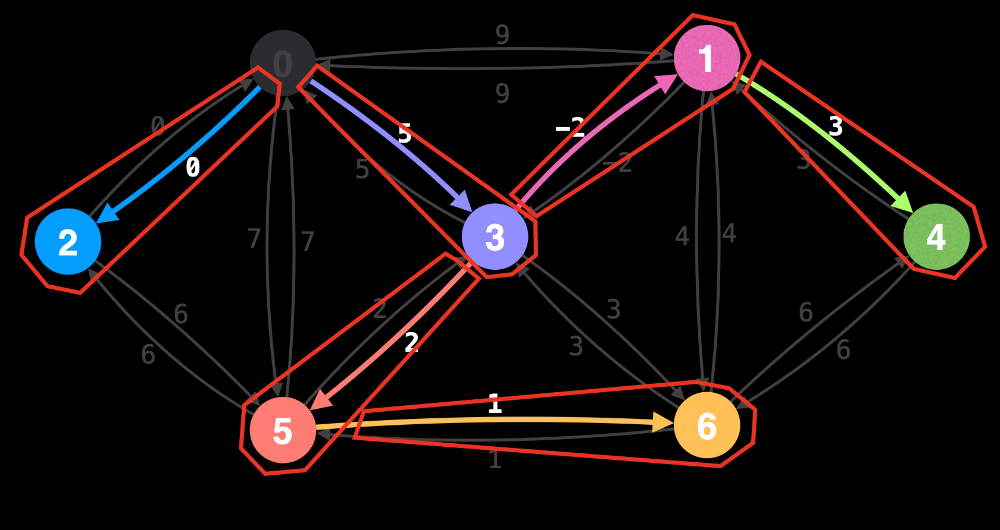

In the eager version of Prim’s we are trying to determine which of a node’s incoming edges we should select to include in the MST.

A slight difference from the lazy version is that instead of adding edges to the PQ as we iterate over the edges of node, we’re going to relax (update) the destination node’s most promising incoming edge.

A natural question to ask at this point is how are we going to efficiently update and retrieve these (node, edge) pairs?

One possible solution is to use an Indexed Priority Queue (IPQ) which can efficiently update and poll key-value pairs. This reduces the overall time complexity from `O(E*logE)` to `O(E*logV)` since there can only be V (node, edge) pairs in the IPQ, making the update and poll operations `O(logV)`.

IPQ is a data structure which is formed when a PQ and a hash table has a baby together. It supports sorted key value pair updates and polls in log time.

### Eager Prim's Algorithm

Maintain a **min IPQ** of size V that sorts vertex-edge pairs (v,e) based on the main edge cost of e. By default, all vertices have a best value of (v, null) in the IPQ.

Start the algorithm on any node 'S'. Mark s as visited and relax all edges of s.

While the IPQ is not empty and a MST has not been formed, dequeue the next best (v,e) pair from the IPQ. Mark the node v as visited and add edge e to the MST.

Next, relax all edges of v while making sure not to relax any edge pointing to a node which has already been visited.

**relaxing** in this context refers to updating the entry for node v in the IPQ from (v, eold) to (v, enew) if the new edge enew from u->v has a lower cost than eold.

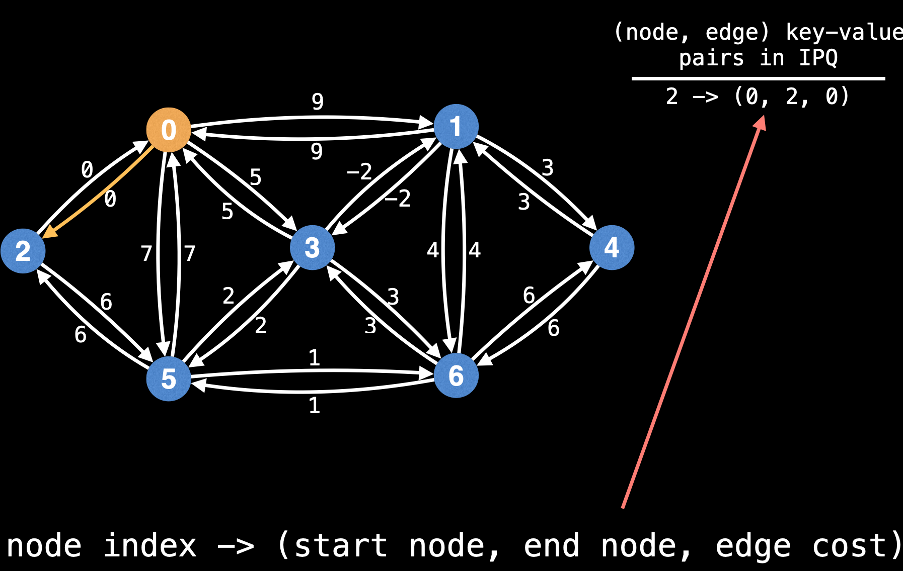
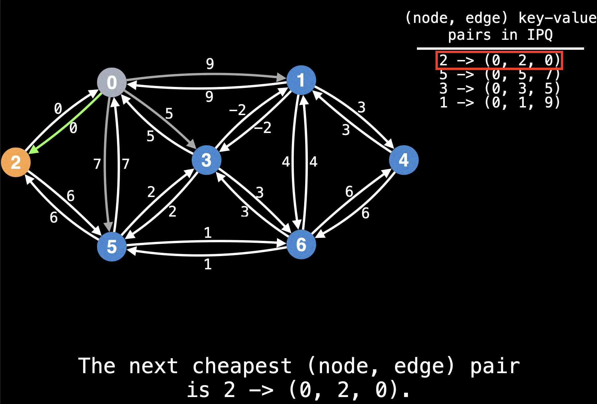
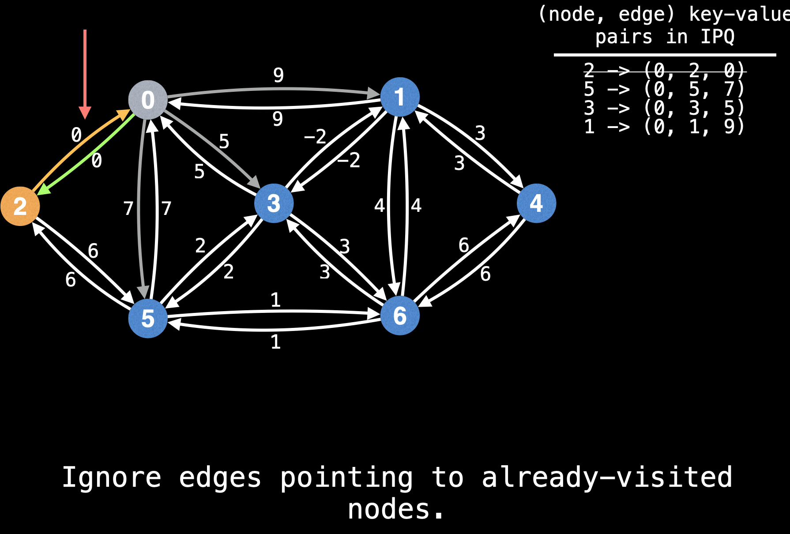
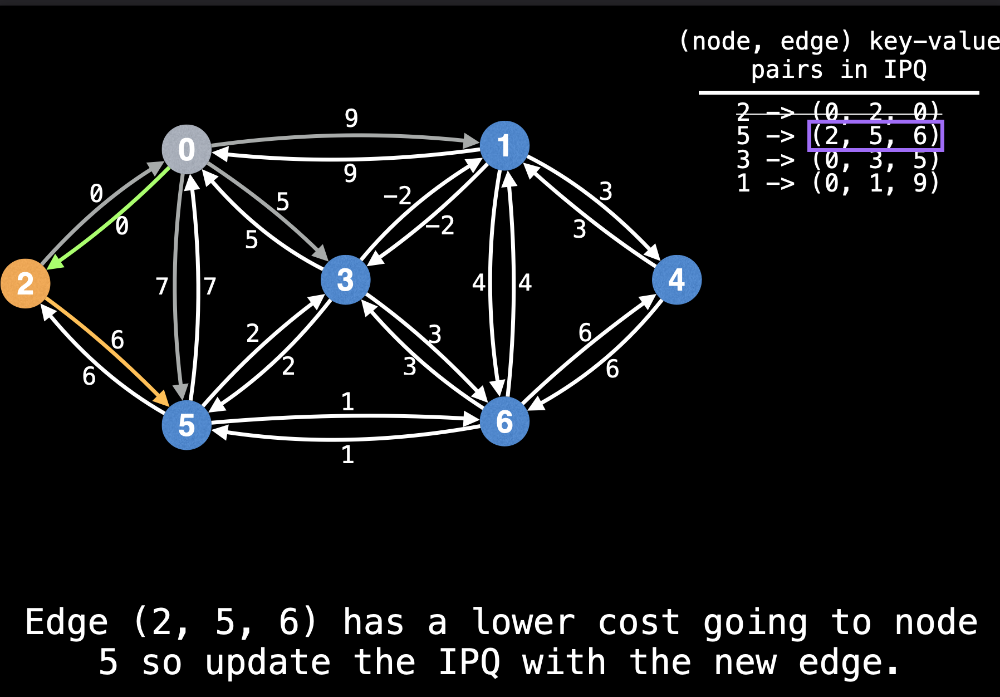
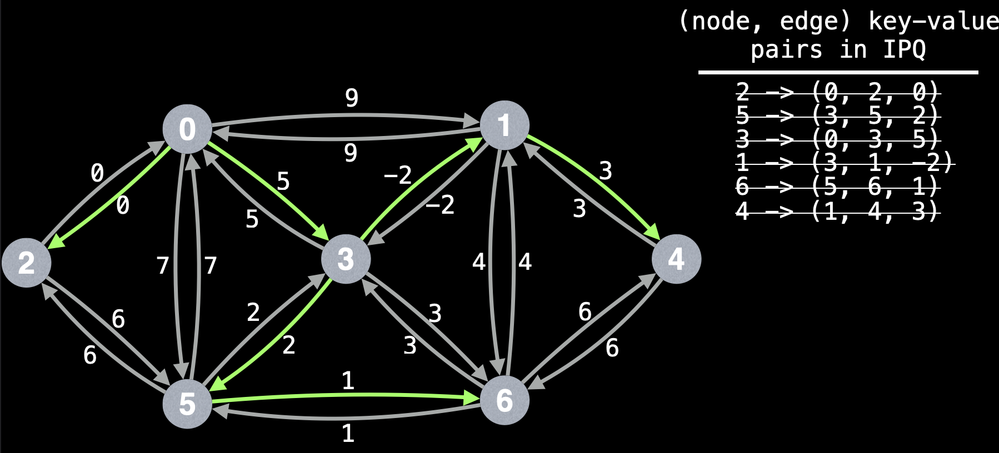

### Eager Prim's Pseudocode

```code
// Let's define a few variables we need:
n = … # Number of nodes in the graph.

ipq = … # IPQ data structure; stores (node index, edge object)
        # pairs. The edge objects consist of {start node, end
        # node, edge cost} tuples. The IPQ sorts (node index,
        # edge object) pairs based on min edge cost.

g = … # Graph representing an adjacency list of weighted edges.
      # Each undirected edge is represented as two directed
      # edges in g. For especially dense graphs, prefer using
      # an adjacency matrix instead of an adjacency list to
      # improve performance.

visited = [false, …, false] # visited[i] tracks whether node i
                            # has been visited; size n

# s - the index of the starting node (0 ≤ s < n)
function eagerPrims(s = 0):
    m = n - 1 # number of edges in MST
    edgeCount, mstCost = 0, 0
    mstEdges = [null, …, null] # size m
    relaxEdgesAtNode(s)

    while (!ipq.isEmpty() and edgeCount != m):
        # Extract the next best (node index, edge object)
        # pair from the IPQ
        destNodeIndex, edge = ipq.dequeue()

        mstEdges[edgeCount++] = edge
        mstCost += edge.cost

        relaxEdgesAtNode(destNodeIndex)

    if edgeCount != m:
        return (null, null) # No MST exists!

    return (mstCost, mstEdges)

function relaxEdgesAtNode(currentNodeIndex):
    # Mark the current node as visited.
    visited[currentNodeIndex] = true

    # Get all the edges going outwards from the current node.
    edges = g[currentNodeIndex]

    for (edge : edges):
        destNodeIndex = edge.to

        # Skip edges pointing to already visited nodes.
        if visited[destNodeIndex]:
            continue

        if !ipq.contains(destNodeIndex):
            # Insert edge for the first time.
            ipq.insert(destNodeIndex, edge)
        else:
            # Try and improve the cheapest edge at destNodeIndex with
            # the current edge in the IPQ.
            ipq.decreaseKey(destNodeIndex, edge)
```
