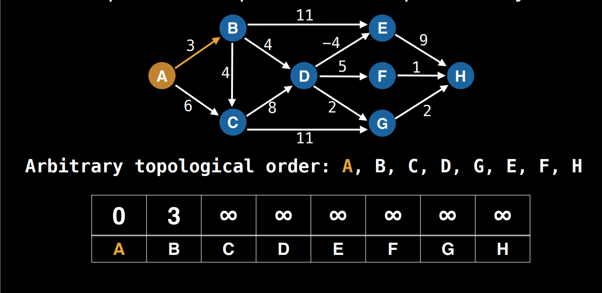
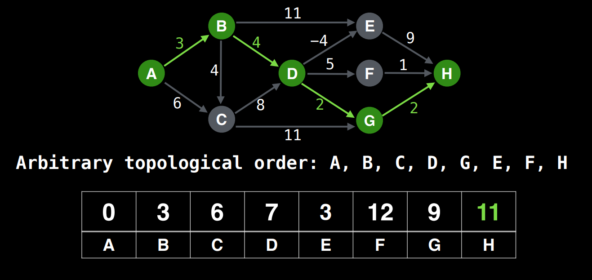
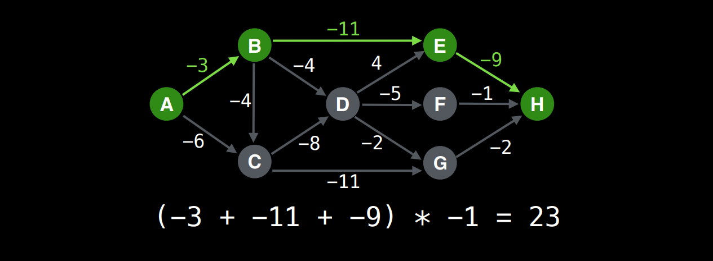

# Shortest/Longest Path on a DAG

## SSSP on DAG

The Single Source Shortest Path problem can be solved efficiently in O(V+E) time. This is due to the fact that nodes can be ordered in topological ordering via topsort and processed sequentially.

1. First find a topological ordering of the nodes.
2. Maintain a distance array with the distance of the starting node as 0
3. From the start node, find adjacent nodes and update the value in the distance node if it's better than what's already there.
4. Then move on to the next node and explore it's edges

## Longest Path on DAG

What about the longest path? On a general graph this problem is NP-Hard but on a DAG the problem is solvable in O(V+E)
The trick is to multiply all the edge values by -1 then find the shortest path and then multiply the edge values by -1 again.

