# Tarjan's Strongly Connected Components

## What are SCCs?

They can be thought of as self-contained cycles within a directed graph where every vertex in a given cycle can reach every other vertex in the same cycle.

## Low-Link Values

To understand Tarjan's algorithm, we need to understand the concept of a low-link value.

The **low-link** value of a node is the smallest [lowest] node id reachable from that node when doing a DFS (including itself)

If we assign low-link values to all nodes of this graph:

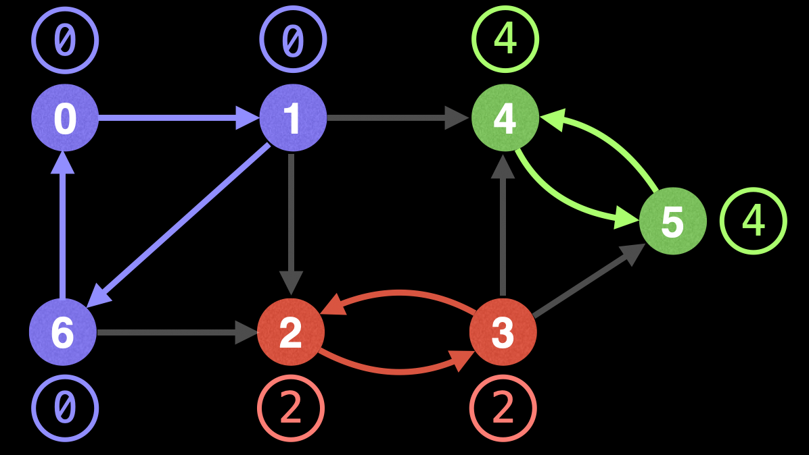

From this, we realize that all nodes with the same low link values belong to the same strongly connected component.

If I assign colors to each SCC, you can clearly see that for each component, all the low-link values are the same. This seems too easy right? Well, you're not wrong, there is a catch. The flaw with this technique is that it is highly dependent on the traversal order of the "DFS", which is effectively random. Let me show you a counterexample

Suppose we take the same graph, and rearrange the node ids as though the "DFS" started at 0, went to node 1, got stuck at the component with node 1, continued on node 2, explored 3, got stuck again and resumed at node 4, went to node 5 and finished at 6.

You'll notice that this time, node 6 in the new graph has a low link value of 0, which should indicate that node 6 is somehow part of node 0's strongly connected component, which we know is not the case.

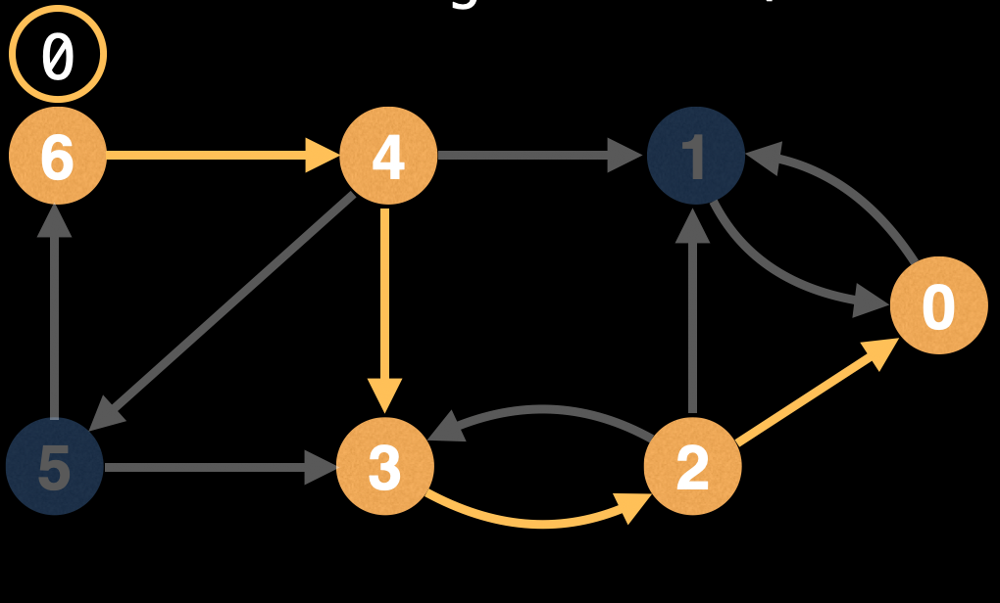

However, that's not the only issue, the real issue is that all the low-link values are the same, but there are clearly multiple SCCs in the graph. What's going on? Well, what's happening is that the low-link values are highly dependent on the order in which the nodes are explored during our "DFS", so we might NOT end up with the correct arrangement of node ids for our low-link values to tell us which nodes are in which SCC. This is where Tarjan's algorithm kicks in, Tarjan's maintains an invariant to prevent the low link values of multiple SCCs from interfering with each other.

### The Stack Invariant

To cope with the random traversal order of the DFS, Tarjan’s algorithm maintains a set (often as a stack) of valid nodes from which to update low-link values from.

Nodes are added to the stack [set] of valid nodes as they’re explored for the first time.

Nodes are removed from the stack [set] each time a complete SCC is found.

**New low-link update condition:**

If u and v are nodes in a graph and we’re currently exploring u then our new low-link update condition is that:

To update node u’s low-link value to node v’s low-link value there has to be a path of edges from u to v and node v must be on the stack.

**Time Complexity:**
Another difference we’re going to make to finding all low-link values is that instead of finding low-link values after the fact we’re going to update them “on the fly” during the DFS so we can get a linear O(V+E) time complexity :)

### Tarjan's Algorithm Overview

Mark the id of each node as unvisited.

Start DFS. Upon visiting a node assign it an id and a low-link value. Also mark current nodes as visited and add them to a seen stack.

On DFS callback, if the previous node is on the stack then min the current node’s low-link value with the last node’s low-link value\*.

After visiting all neighbors, if the current node started a connected component\*\* then pop nodes off stack until current node is reached.

\*This allows low-link values to propagate throughout cycles.

\*\*As we will see, a node started a connected component if its id equals its low link value

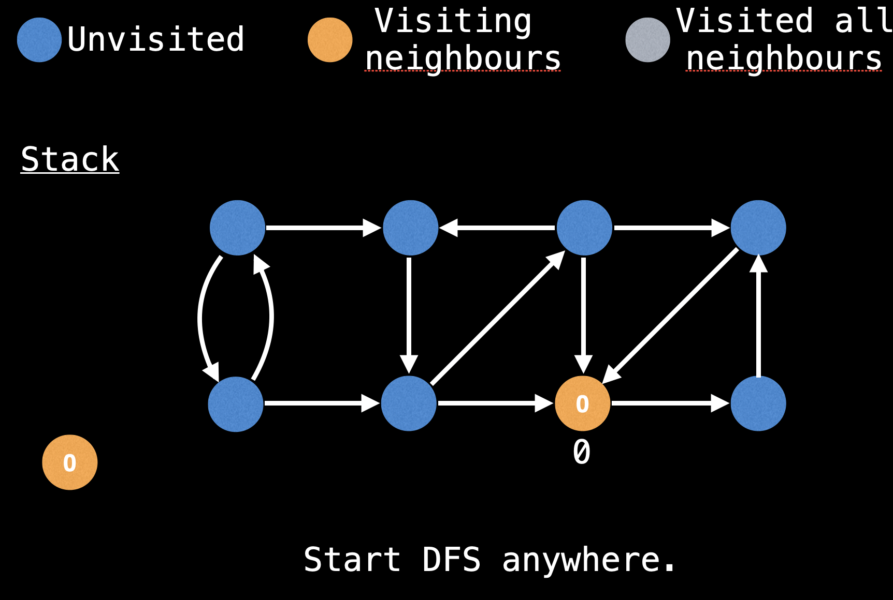
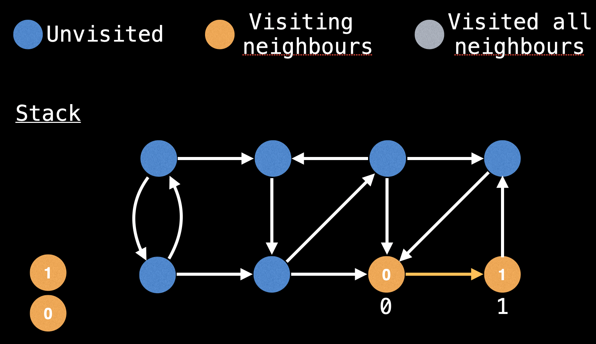
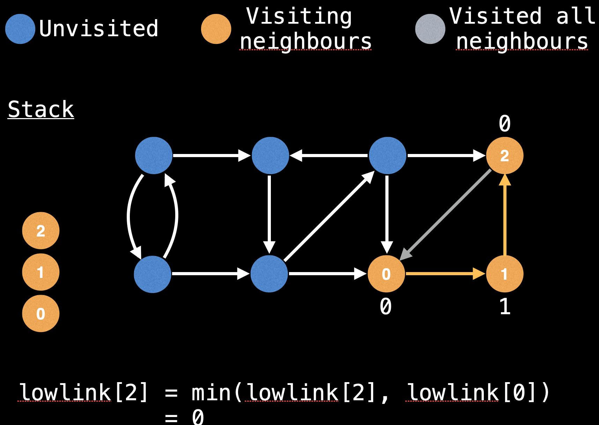
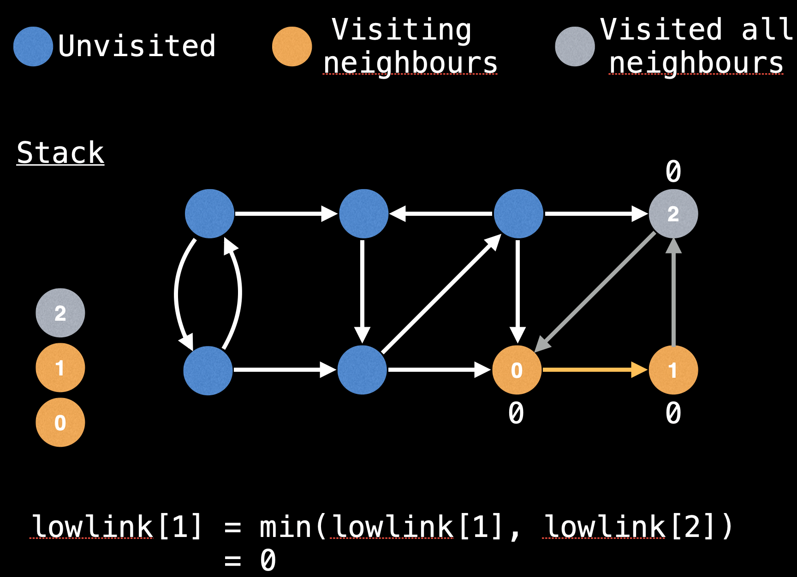
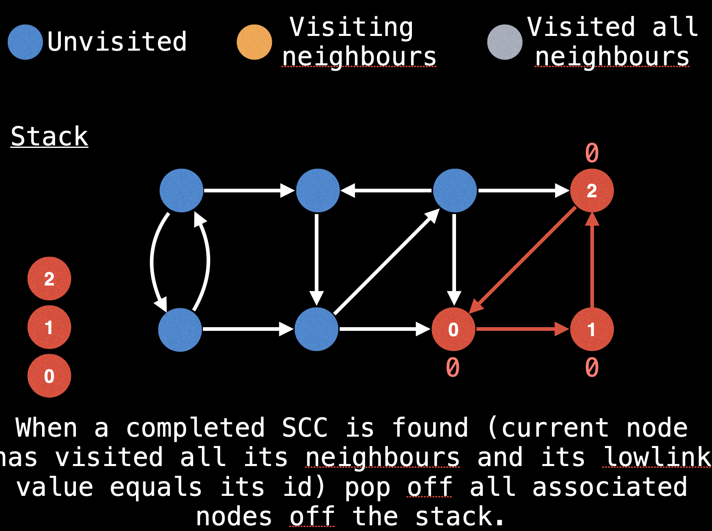
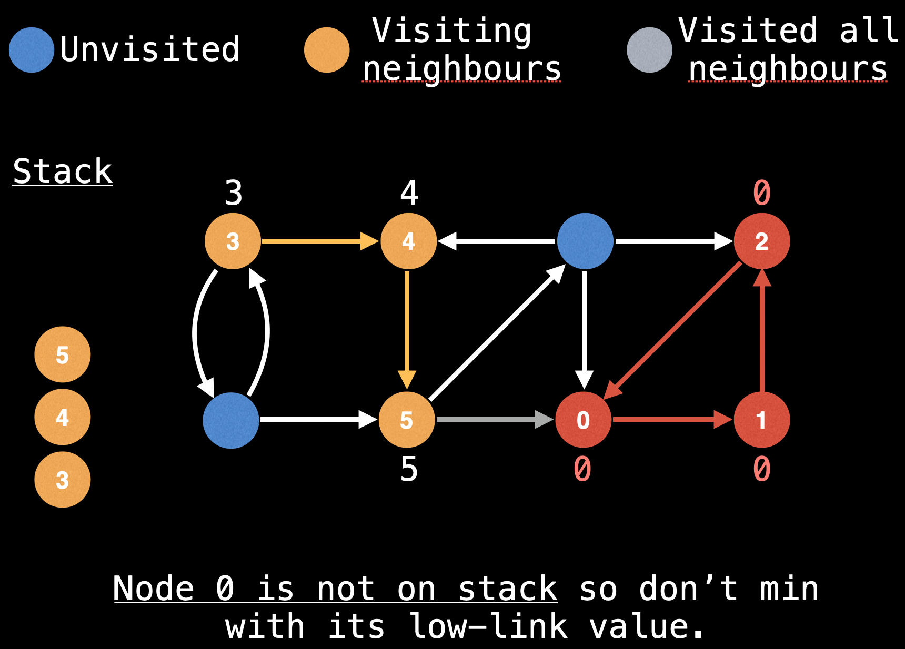
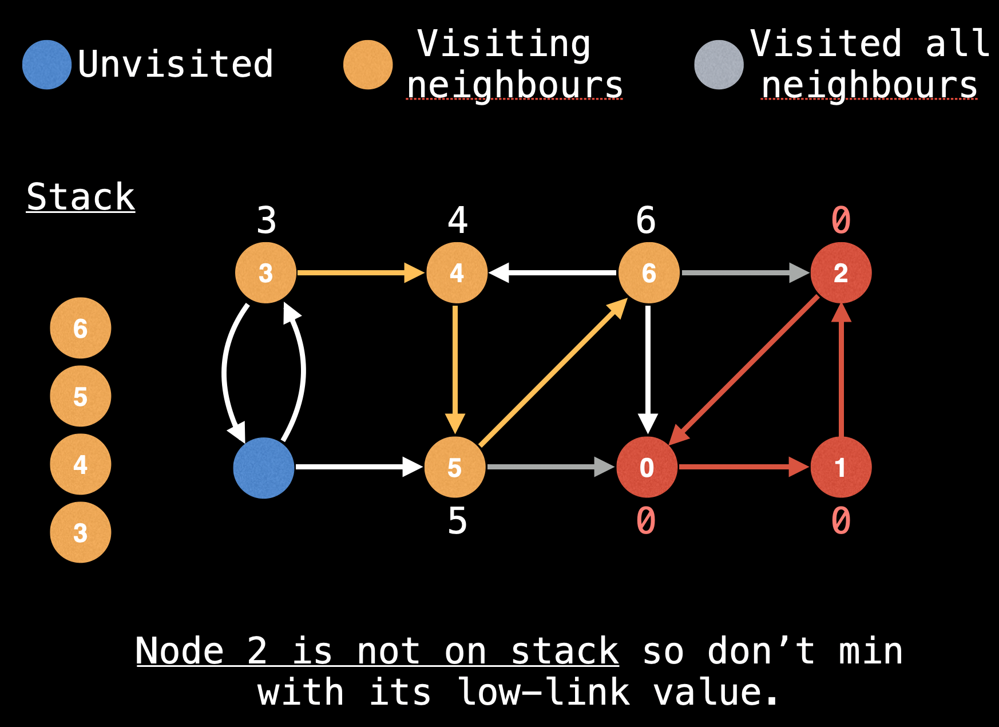
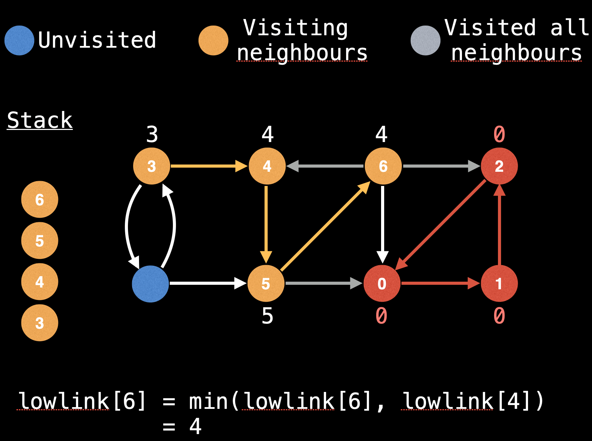
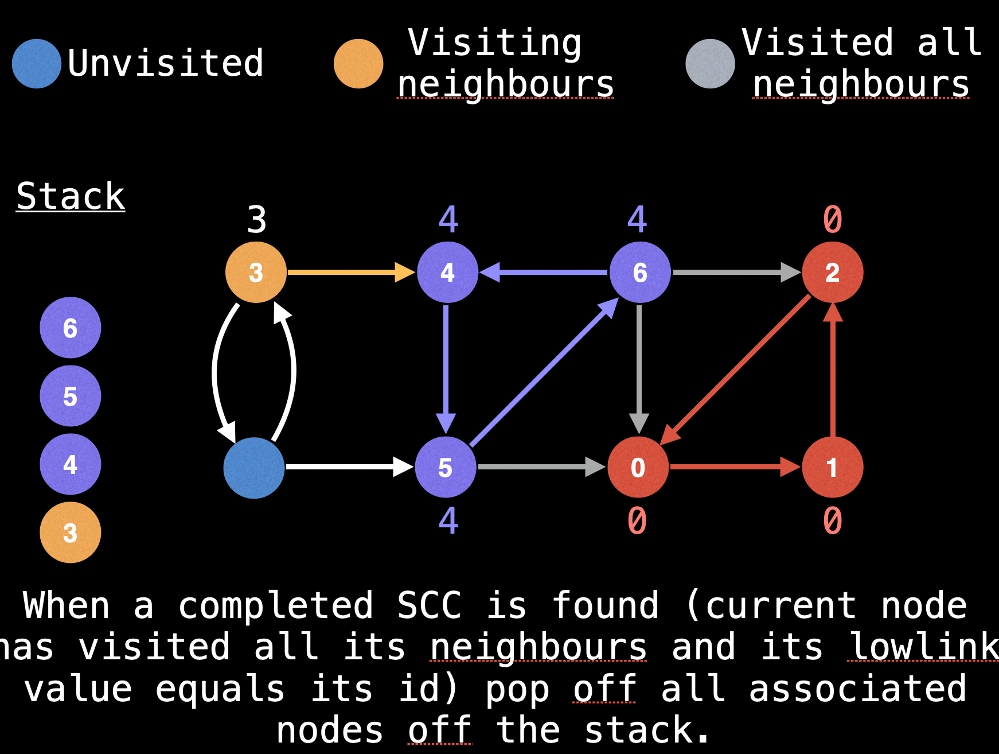
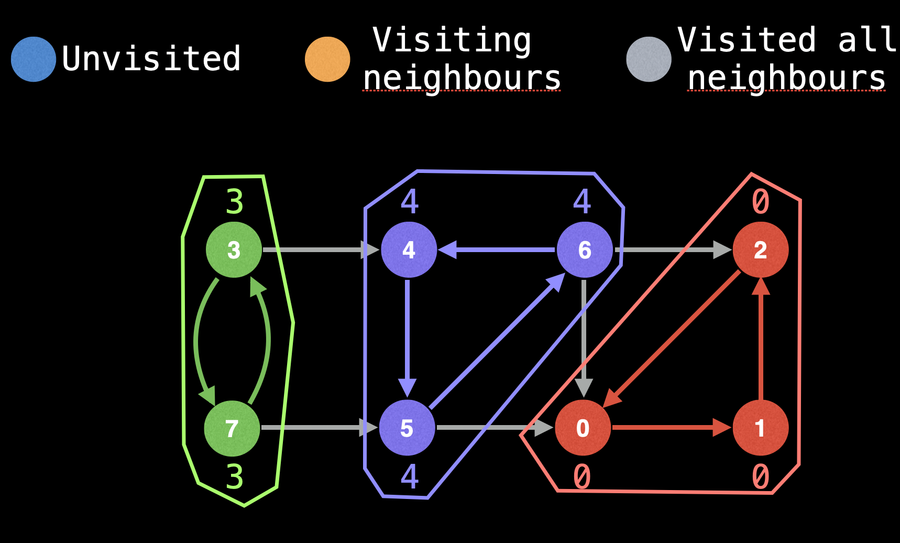

**Pseudocode:**

```code
UNVISITED = -1
n = number of nodes in the graph
g = adj list with directed edges

id = 0 # used to give each node an id
sccCount = 0 # used to count the number of SCCs

// index i in these arrays represents node i
ids = [0, 0, ... ,0] // length n
low = [0, 0, ..., 0] // length n
onStack = [false, false, ... , false] // length n
stack = empty data structure

function findSccs():
    for(i = 0; i < n; i++): ids[i] = UNVISITED
    for(i = 0; i < n; i++):
        if(ids[i] === UNVISITED):
            dfs(i)

    return low

function dfs(at):
    stack.push(at)
    onStack[at] = true;
    ids[at]= low[at] = id++;

    // visit all neighbors & min low-link on callback
    for(let to of g[at]):
        if(ids[to] === UNVISITED): dfs(to)
        if(onStack[to]): low[at] = min(low[at], low[to])

    // After having visited all neighbots of at if we're at the start of
    // SCC empty the seen stack until we're back to start of SCC
    if(ids[at] === low[at]):
        for(let node = stack.pop(); node !== at; node = stack.pop()):
            onStck[node] = false
            low[node] = ids[at]
            if(node === at): break
        sccCount++
```
