# Union Find

**Union Find** is a data structure that keeps track of elements which are split into one or more disjoint sets. It has two primary operations: **find** and **union**.
**Find** - given an element, tells you what group the element belongs to
**Union** - merges two groups together

(Magnets Example)

**When and Where to is a Union Find Used?**

- Kruskal's minimum spanning tree algorithm
- Grid percolation
- Network connectivity
- Least common ancestor in trees
- Image Processing

**COMPLEXITIES**

Construction = O(n)

Union = α(n)

Find = α(n)

Get component size = α(n)

Check if connected = α(n)

Count components = O(1)

α(n) = Amortized constant time

## Kruskal's Minimum Spanning Tree Algorithm

A **minimum spanning tree** is a subset of the edges which connect all vertices in the graph with minimal total edge cost.

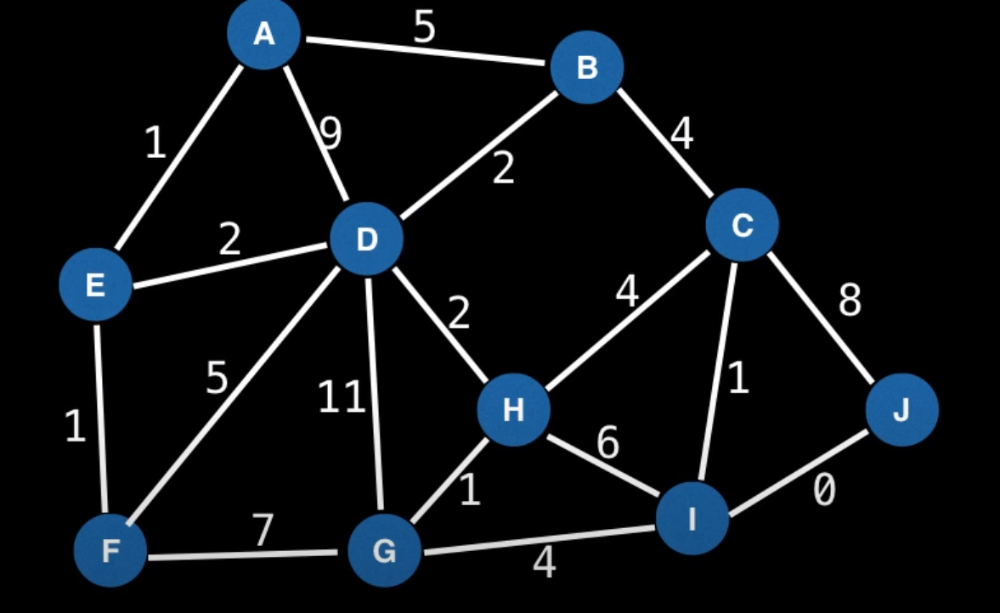

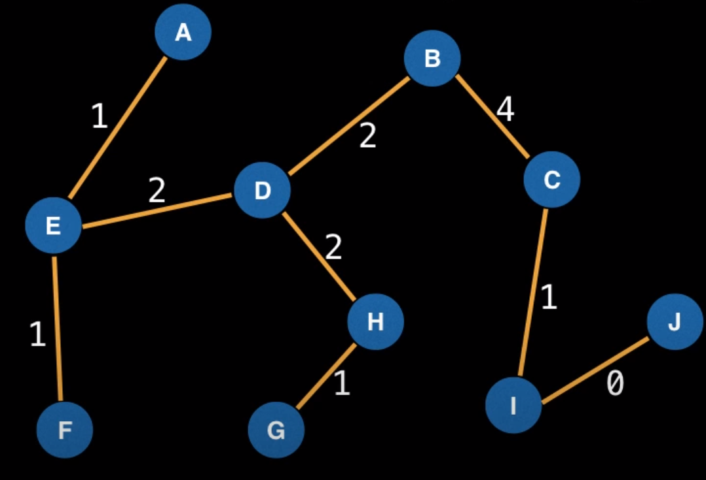

**How does it work?**

1. Sort edges by ascending edge weight

2. Walk through the sorted edges and look at the two nodes the edge belongs to. If the nodes are already unified, we don't include this edge, otherwise we include it and unify the nodes.

3. The algorithm terminates when every edge has been processed or all vertices have been unified.

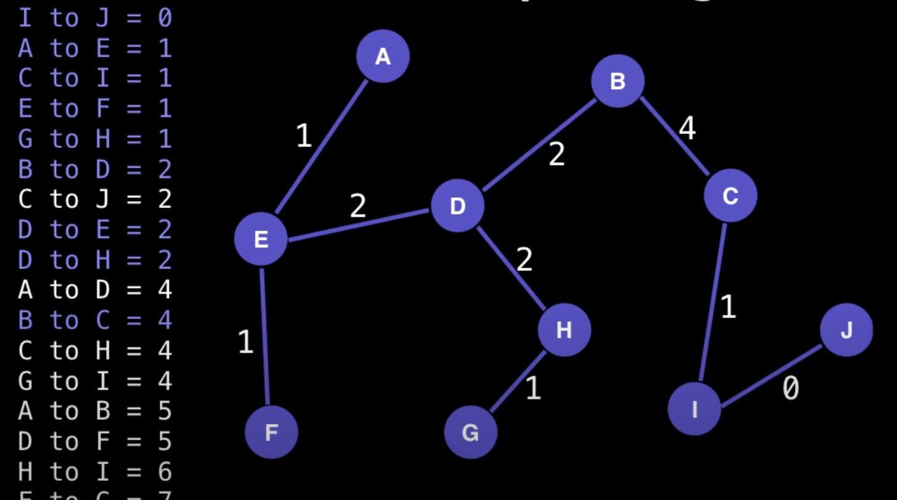

## Creating a Union Find

To begin using Union Find, first construct a bijection (a map) between your objects and the itegers in the range [0, n).

**Note:**: This step is not necessary in general, but it will allow us to construct an array-based union find.

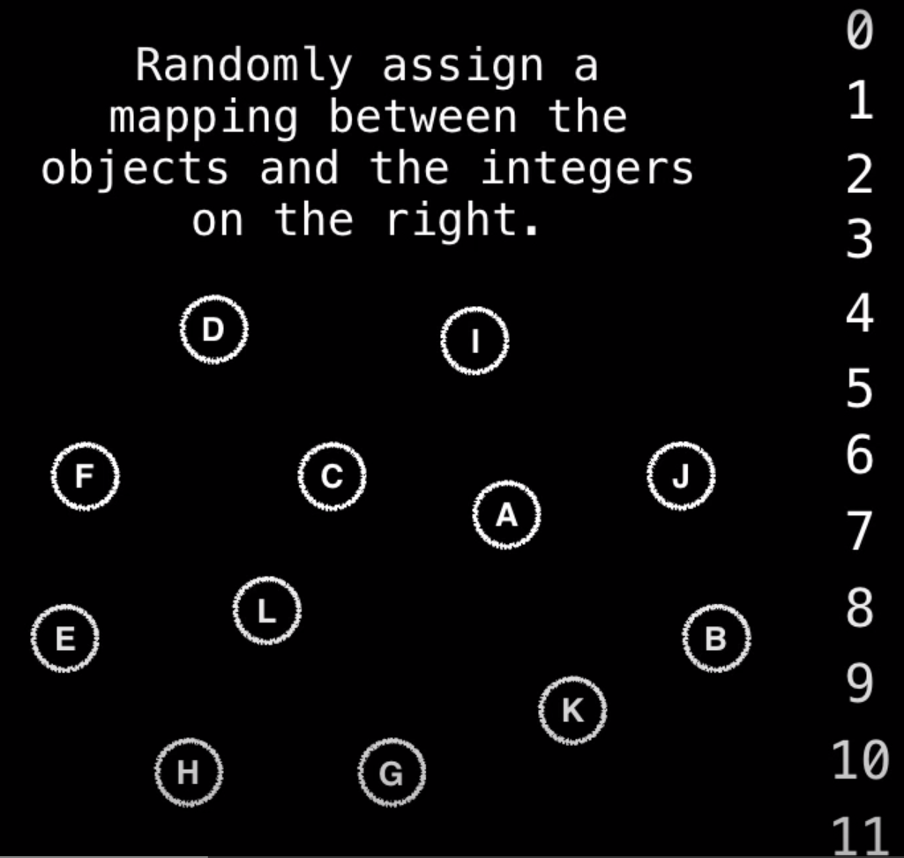

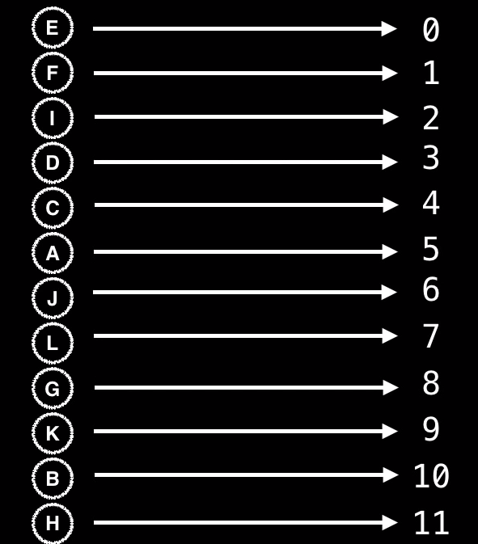

We can use a hashmap to store these mappings.

Next, we're going to construct an array and each index is going to have an associated object and this is possible through our mapping.

Now, what you see in this picture is the array we created at the top which contains our mapping. In the center is a visual representation of what's going on. The value in the array for each position is currently the index which it is at. This is because originally every node is a root node i.e. it maps to itself. But, as we perform the instructions on the left of unifying groups or objects together into groups, we're going to find that we're going to change values in our array to map to other letters.
Specifically, the way we're going to do it for some index i in our array, index i's parent is going to be whatever index is at position i.

For instance, to unify C and K, we look at C and K and discover that C has a root node of 4 and K has a root node of 9. So, either C is going to be K's parent or the other way round. We choose that K's parent is going to be C. So, now at index 9 i.e. K's position we put a 4.

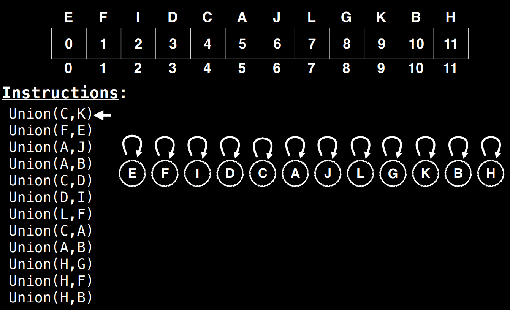

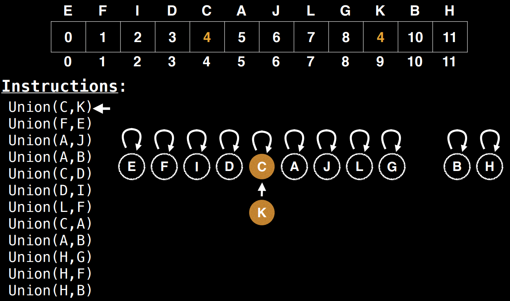

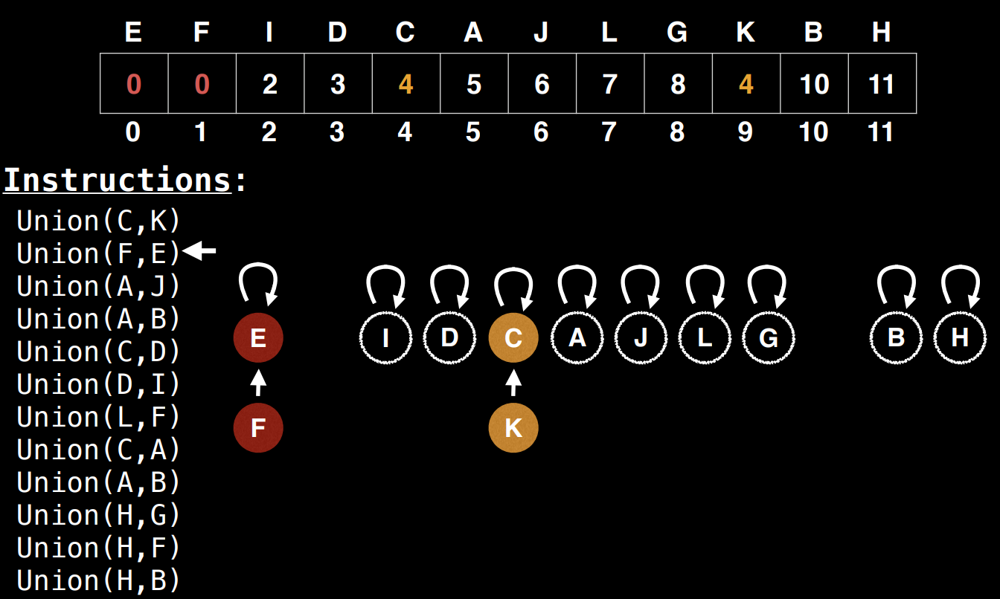

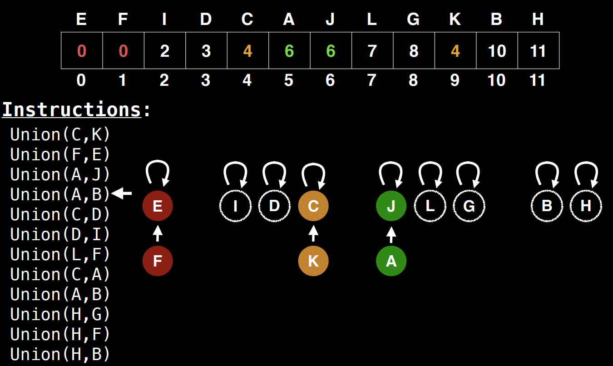

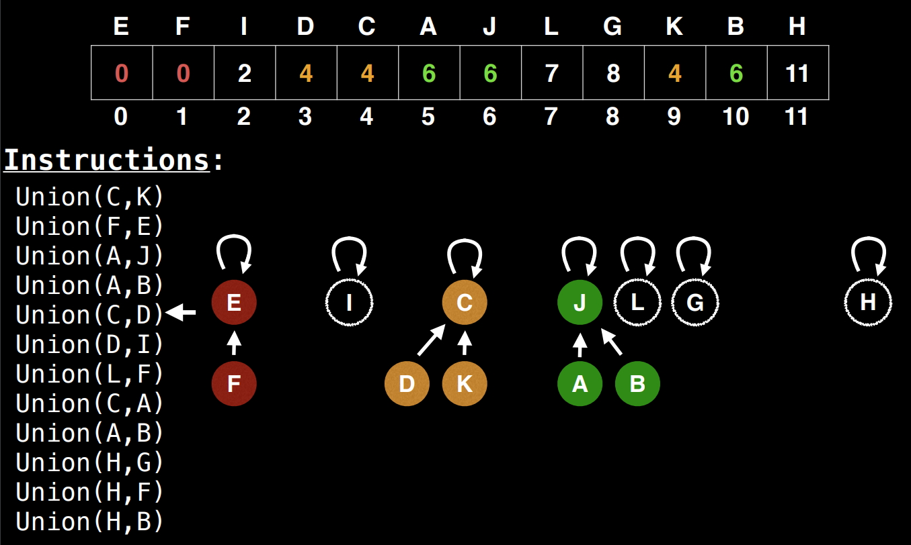

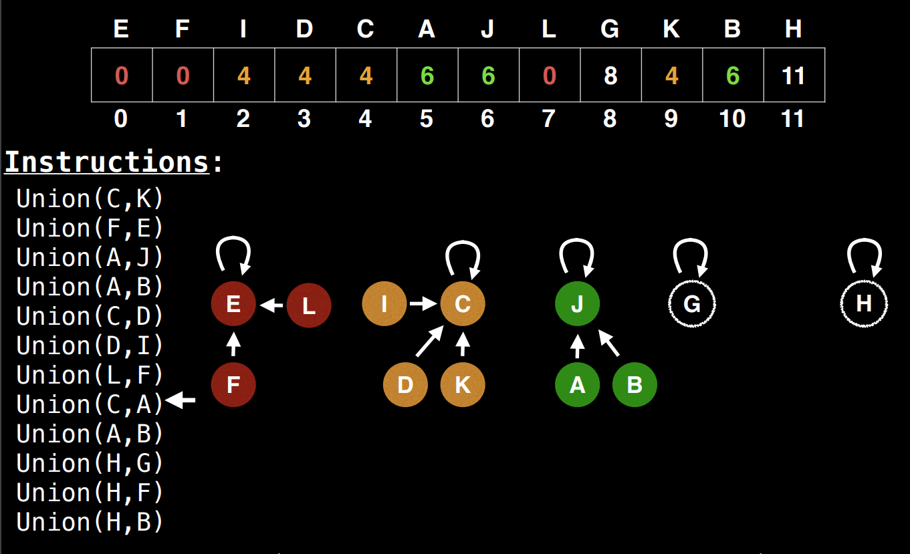

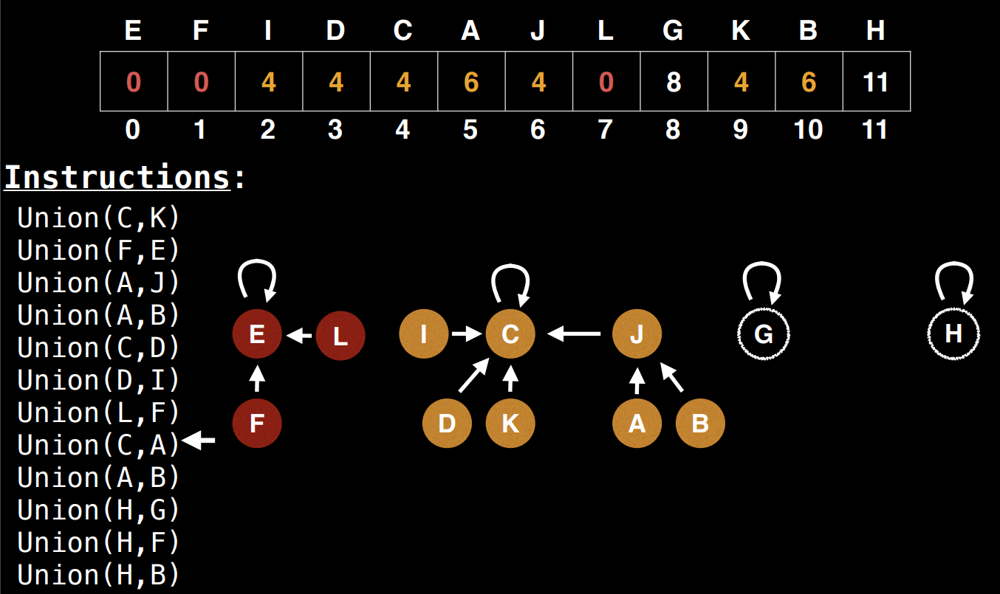

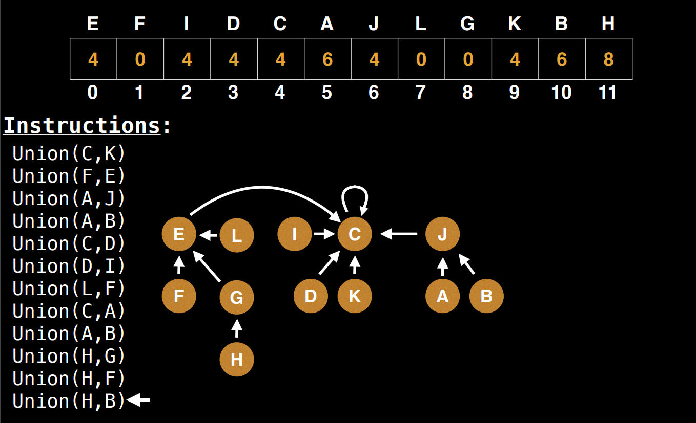

Here, we're not using path compression which is an optimization on the union find.

### SUMMARY

**Find Operation:** To **find** which component a particular element belongs to, find the root of that component by following the parent nodes until a slef loop is reached (a node who's parent is itself).

**Union Operation:** To **unify** two elements find which are the root nodes of each component and if the root nodes are different, make on of the root nodes be the parent of the other.

### REMARKS

In this data structure, we do not "un-union" elements. In general, this would be very inefficient to do since we would need to update all the children of a node.

The number of components is equal to the number of roots remaining. Also, remark that the number of root nodes never increases.

Our current version of Union Find does not support the nice α(n) time complexity we want. Checking if H and B belong to the same group takes five hops and in the worst case this is potentially much more.

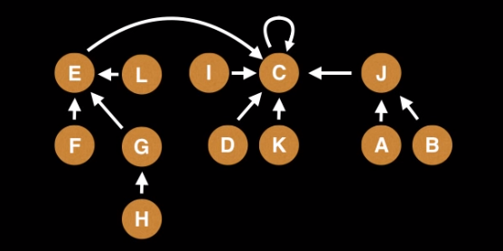

## Path Compression

This is what makes union find a remarkable data structure.

During the find method, you also update the pointer of all the nodes from the node to the root to point to the root directly, so next time you can directly access its root without traversing the entire length.

The following images show the difference when no path compression is used and when it is used.

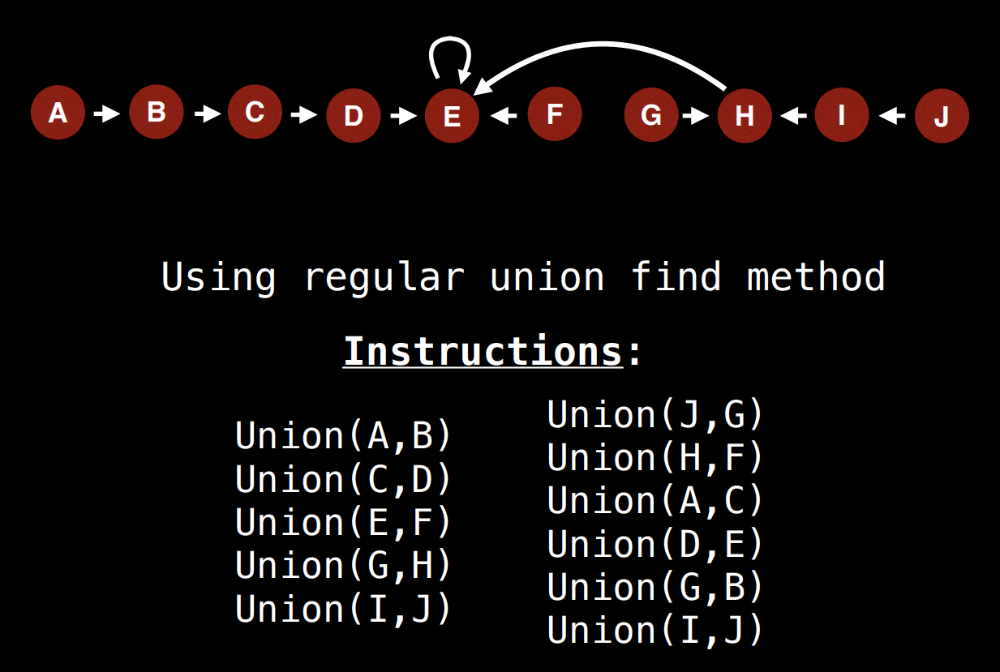

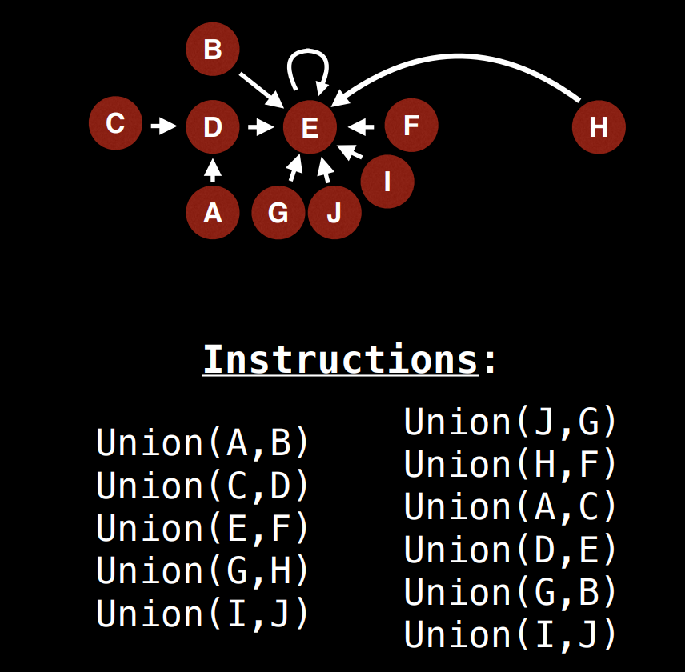

## Code

[Union Find Code](../Union%20Find/union-find.js)
